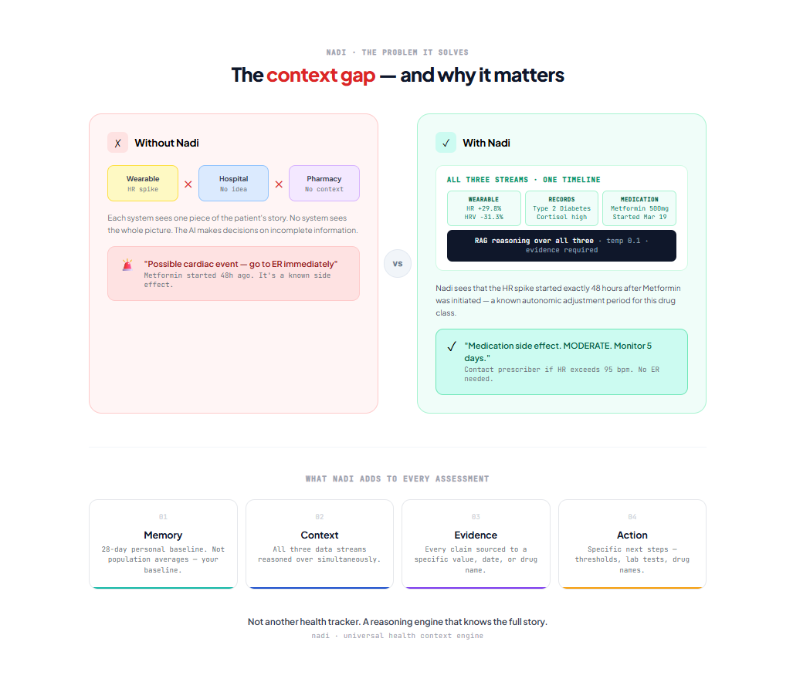
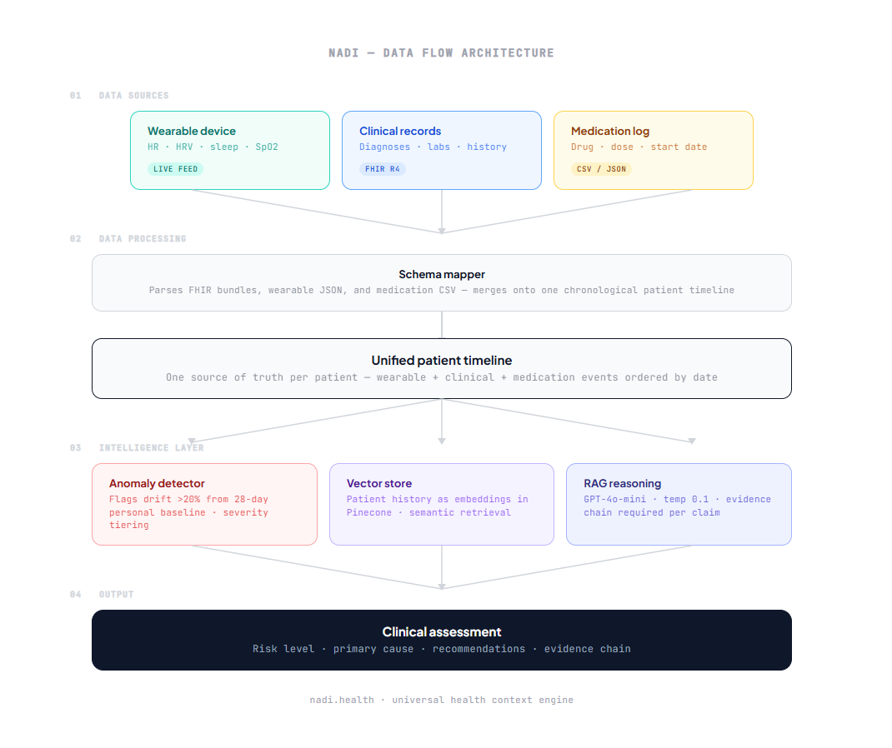
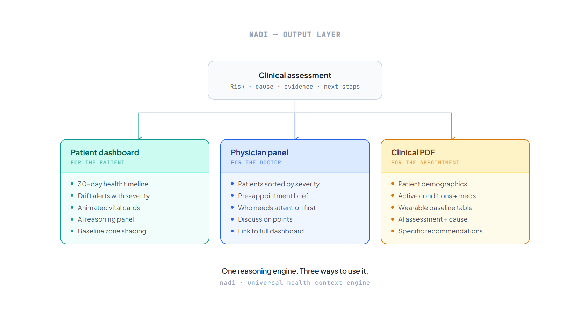

# Nadi — Universal Health Context Engine

> Medical AI sees a snapshot. Nadi sees the full story.

---

## The Problem

Your wearable knows your heart rate.
Your hospital knows your diagnosis.
Your pharmacy knows your medications.

None of them talk to each other.

When AI tries to help, it only sees one piece at a time. A heart rate spike becomes
"possible cardiac event" — because the AI doesn't know you started a new medication
48 hours ago. The data to answer that question exists. It's just fragmented.

Nadi is the missing context layer. It unifies three health data streams and reasons
over all of them together — so medical AI stops making dangerous guesses.

---

## What Nadi Does

**Unifies three data streams into one patient timeline**
Wearable biometrics (heart rate, HRV, sleep, SpO2), clinical history (diagnoses,
lab results via FHIR R4), and medication logs — merged onto a single chronological
timeline per patient.

**Detects health drifts against a personal baseline**
Not population averages. Each patient's own 28-day baseline. Any metric deviating
more than 20% triggers an alert — a threshold grounded in remote patient monitoring
literature (mu+-2sigma).

**Explains the why, not just the what**
Using RAG over patient history stored in Pinecone, Nadi generates a clinical
assessment that names the exact cause, specific thresholds, and sourced
recommendations. Every claim traces back to the data point that supports it.

**Gives physicians a pre-appointment brief**
A physician panel sorted by patient severity — most critical first. One click shows
what changed, why it changed, and what to discuss before the appointment begins.

**Generates a clinical PDF report**
One button. Full clinical summary — demographics, AI assessment, medications,
wearable baseline vs current, recommendations — streamed as bytes from the server.

---

## Demo

> Patient: Sarah Mitchell, 42F, Type 2 Diabetes
>
> Event: Started Metformin 500mg on March 19
>
> What happened: HR rose 29.8% above baseline. HRV dropped 31.3%. Sleep fell 22%.
> All within 48 hours of medication initiation.
>
> Standalone AI verdict: possible cardiac event.
> Nadi verdict: Metformin autonomic adjustment. Monitor 5 days. Not an emergency.
>
> That difference is the whole product.

---

## Architecture

```
┌─────────────────────────────────────────────────────────┐
│                     DATA INGESTION                      │
│                                                         │
│   Wearable JSON    FHIR R4 Bundle    Medications CSV    │
│        │                │                  │            │
│        └────────────────┴──────────────────┘            │
│                         │                               │
│              Python Schema Mapper                       │
│                         │                               │
│              Unified Patient Timeline                   │
└─────────────────────────┬───────────────────────────────┘
                          │
┌─────────────────────────▼───────────────────────────────┐
│                    INTELLIGENCE LAYER                   │
│                                                         │
│   Anomaly Detector          Vector Store (Pinecone)     │
│   28-day personal           Patient history as          │
│   baseline · 20% threshold  embeddings · RAG retrieval  │
│                                                         │
│                    GPT-4o-mini                          │
│         Structured prompt · temperature 0.1             │
│         JSON output · evidence chain required           │
└─────────────────────────┬───────────────────────────────┘
                          │
┌─────────────────────────▼───────────────────────────────┐
│                      FRONTEND                           │
│                                                         │
│   Patient Dashboard    Physician Panel    PDF Report    │
│   Timeline + baseline  Sorted by         Clinical       │
│   shading · vitals     severity · briefs summary        │
└─────────────────────────────────────────────────────────┘
```

---

## Architecture Diagrams

These diagrams show the exact problem Nadi solves and how the system converts fragmented signals into clinician-ready decisions.

### 1) Context Gap

`docs/diagrams/context_gap.png` visualizes the core healthcare fragmentation problem: wearable, clinical, and medication data exist in separate silos. This is why one-stream AI can misclassify events that are actually medication-related.



### 2) End-to-End Data Flow

`docs/diagrams/data_flow.png` maps Nadi's full pipeline from ingestion to reasoning: source data -> schema mapping -> drift detection -> RAG retrieval -> structured AI output. It reflects the architecture implemented in `backend/ingestion`, `backend/engine`, and the FastAPI layer.



### 3) Output Layer

`docs/diagrams/output_layer.png` shows how one shared intelligence layer powers multiple surfaces: patient dashboard, physician panel, and PDF report. This is the product advantage — one consistent clinical narrative delivered in role-specific formats.



---

## Tech Stack

| Layer | Technology |
|---|---|
| Backend API | Python, FastAPI |
| AI / LLM | OpenAI GPT-4o-mini |
| Embeddings | OpenAI text-embedding-3-small |
| Vector Store | Pinecone (serverless) |
| Clinical Data | Synthea FHIR R4 |
| Frontend | Next.js 14, TypeScript |
| Styling | Tailwind CSS, Framer Motion |
| Charts | Chart.js, chartjs-plugin-annotation |
| PDF | ReportLab |
| Data Processing | Pandas, NumPy |

---

## Project Structure

```
nadi/
├── backend/
│   ├── main.py                    # FastAPI app + endpoints
│   ├── requirements.txt
│   ├── ingestion/
│   │   ├── fhir_parser.py         # Synthea FHIR R4 parser
│   │   ├── wearable_generator.py  # Synthetic wearable data
│   │   └── med_parser.py          # Medication CSV reader
│   ├── engine/
│   │   ├── schema_mapper.py       # Unified patient timeline
│   │   ├── anomaly_detector.py    # Drift detection
│   │   ├── rag_engine.py          # Pinecone + GPT reasoning
│   │   └── pdf_generator.py       # Clinical PDF output
│   └── data/
│       ├── synthea_output/        # FHIR patient files
│       ├── terra_mock/            # Wearable JSON files
│       └── medications.csv        # Medication log
│
└── frontend/
    ├── pages/
    │   ├── index.tsx              # Landing
    │   ├── patient.tsx            # Patient dashboard
    │   └── doctor.tsx             # Physician panel
    ├── components/
    │   ├── HealthTimeline.tsx     # 30-day chart + baseline
    │   ├── AlertCard.tsx          # Drift alerts
    │   ├── AIReport.tsx           # AI reasoning output
    │   └── VitalCard.tsx          # Animated vitals
    └── lib/
        └── api.ts                 # Typed API client
```

---

## Quick Start

### Prerequisites

- Python 3.9+
- Node.js 18+
- Java 17+ (for Synthea)
- OpenAI API key
- Pinecone API key (free tier)

### Backend

```bash
# Clone the repo
git clone https://github.com/yourusername/nadi
cd nadi/backend

# Create virtual environment
python -m venv venv
source venv/bin/activate  # Windows: venv\Scripts\activate

# Install dependencies
pip install -r requirements.txt

# Set environment variables
cp .env.example .env
# Add your OPENAI_API_KEY and PINECONE_API_KEY to .env

# Generate demo patient data
python generate_sarah_wearable.py
python generate_all_wearables.py

# Generate AI cache for demo
python cache_demo_response.py
python generate_all_caches.py

# Start the API
uvicorn main:app --reload --port 8000
```

API runs at `http://localhost:8000`
Swagger docs at `http://localhost:8000/docs`

### Frontend

```bash
cd nadi/frontend

# Install dependencies
npm install

# Start dev server
npm run dev
```

Frontend runs at `http://localhost:3000`

### Environment Variables

```bash
# backend/.env.example
OPENAI_API_KEY=
PINECONE_API_KEY=
```

---

## API Endpoints

| Method | Endpoint | Description |
|---|---|---|
| GET | `/health` | System health check |
| GET | `/patient/{id}/timeline` | Full unified patient timeline |
| GET | `/patient/{id}/alerts` | Detected drift alerts with severity |
| GET | `/patient/{id}/analyze/cached` | Pre-cached AI assessment |
| POST | `/patient/{id}/analyze` | Live AI reasoning call |
| POST | `/patient/{id}/report` | Download clinical PDF |

---

## Demo Patients

Four synthetic patients with real data pipelines:

| Patient | Age | Condition | Severity | Story |
|---|---|---|---|---|
| Sarah Mitchell | 42F | Type 2 Diabetes | MODERATE | Metformin initiation drift |
| James Kowalski | 67M | Cardiac history | HIGH | Carvedilol autonomic response |
| Priya Lakshmanan | 55F | Post-surgical | MODERATE | NSAID-related drift |
| Marcus Webb | 38M | Healthy baseline | NONE | Stable — all clear |

---

## Key Design Decisions

**Personal baseline over population norms**
A fit 28-year-old and a 67-year-old cardiac patient can share the same resting HR. Population averages would generate false positives for one and miss real events for the other. Every patient's baseline is their own.

**RAG over fine-tuning**
Fine-tuning a medical model requires datasets and compute that don't exist in a hackathon timeline. RAG gives the model access to a specific patient's actual history at inference time — grounded in real data, not statistical patterns.

**Temperature 0.1**
Medical reasoning needs consistency. The same input must produce the same risk level across sessions. Consistency is a safety property.

**Evidence chain as architecture requirement**
Healthcare professionals will not trust AI they cannot interrogate. Every AI claim names a specific value, date, or drug name — traced back to its source stream. Not "elevated vitals." "HR rose from 63 to 88 bpm 48 hours after Metformin initiation [medication_log]."

**20% drift threshold**
Not arbitrary. Aligns with the mu+-2sigma range used in published remote patient monitoring literature for defining clinically meaningful vital sign deviation.

---

## Honest Constraints

This is a working prototype built on synthetic patient data from Synthea. The AI pipeline is real. The data architecture is real. The clinical thresholds are grounded in published research.

Nothing in this system should be used for actual clinical decisions without physician review. Every output includes this disclaimer — in the UI and in the PDF.

What this demonstrates: that the architecture works, the reasoning is contextual, and the gap between this prototype and a production system is integration work — not a rebuild.

---

## What's Next

- **Epic FHIR API integration** — federally mandated open API, parser already compatible
- **Real-time wearable streaming** — Terra API webhooks, schema mapper requires no changes
- **Patient symptom logging** — natural language input, interpreted in clinical context
- **Multilingual output** — Hindi, Marathi, Tamil for community health worker deployment

---

## License

MIT

---

*Built for people whose health data exists everywhere — and means nothing alone.*
